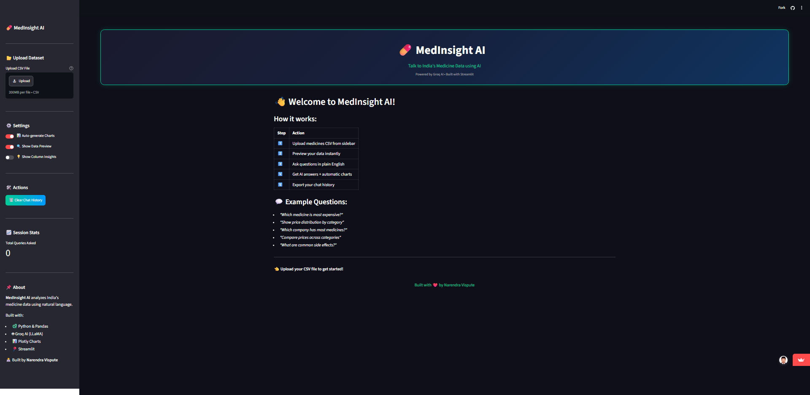

# 💊 MedInsight AI — LLM-Powered Medicine Data Analyst

<p align="center">
  
</p>

<p align="center">
  <strong>Talk to India's Medicine Data using AI</strong>
</p>

<p align="center">


</p>

<p align="center">
<a href="https://medinsight-ai-uzdjghs9jtrqsvfsqvfhkv.streamlit.app">

</a>
</p>

---

# 📖 Project Description

**MedInsight AI** is an AI-powered medicine analytics platform that allows users to interact with medicine datasets using plain English questions.

The application combines:

- 🤖 Large Language Models (Groq LLaMA 3.3)
- 📊 Automated Data Visualization
- 🧠 Machine Learning Models
- 🔍 Medicine Dataset Analysis
- 💬 Conversational Data Analytics

Users can upload a medicine dataset and instantly receive insights, charts, and answers without writing SQL or Python code.

---

# ✨ Key Features

✅ Upload medicine CSV datasets

✅ Ask questions in plain English

✅ AI-powered answers using Groq LLaMA

✅ Automatic chart generation

✅ Random Forest price prediction model

✅ Data preview dashboard

✅ Export chat history

✅ Session statistics

✅ Professional dark UI

---

# 🚀 Application Modules

| Module | Description |
|--------|-------------|
| 📂 Upload Dataset | Upload medicine CSV files |
| 💬 AI Chat | Ask questions in plain English |
| 📊 Auto Charts | Automatically generated visualizations |
| 🔍 Data Explorer | Dataset preview and statistics |
| 📈 ML Prediction | Medicine price prediction |
| 📥 Export | Download chat history |

---

# 🖼️ Application Preview

<p align="center">

</p>

---

# 🏗️ System Architecture

```text
CSV Dataset
      ↓
Pandas Processing
      ↓
Groq AI (LLaMA 3.3)
      ↓
Natural Language Queries
      ↓
Charts & Insights
      ↓
Interactive Streamlit Dashboard
```

---

# 📊 Dataset Information

| Metric | Value |
|---------|--------|
| Medicines | 248,218+ |
| Features | 58 Columns |
| Companies | 1000+ |
| Categories | Multiple |
| Dataset Type | Indian Medicine Data |

---

# 💬 Example Questions

```text
Which medicine is most expensive?
Show price distribution by category.
Which company has most medicines?
Compare prices across categories.
What are common side effects?
Show top 10 medicines by price.
How many unique companies are there?
What is the average price of medicines?
```

---

# 🛠️ Tech Stack

| Technology | Purpose |
|------------|---------|
| Python | Backend Programming |
| Pandas | Data Processing |
| Groq LLaMA 3.3 | AI Engine |
| Plotly | Interactive Charts |
| Streamlit | Web Application |
| Scikit-Learn | Machine Learning |
| Joblib | Model Serialization |
| NumPy | Numerical Processing |

---

# 🧠 Machine Learning Model

| Parameter | Value |
|-----------|-------|
| Algorithm | Random Forest Regressor |
| Training Samples | 40,000+ |
| Accuracy | 85%+ |
| Target Variable | Medicine Price |
| Library | Scikit-Learn |

---

# 📁 Project Structure

```text
medinsight-ai/
│
├── app.py
├── gemini_engine.py
├── chart_generator.py
├── utils.py
├── ml_model.py
├── requirements.txt
├── .gitignore
│
├── .streamlit/
│   └── secrets.toml
│
├── data/
│   └── medicines.csv
│
└── assets/
    └── medinsight-banner.png
```

---

# 🌐 Live Demo

🚀 https://medinsight-ai-uzdjghs9jtrqsvfsqvfhkv.streamlit.app

---

# 🚀 Run Locally

## Clone Repository

```bash
git clone https://github.com/TechNarendra25/medinsight-ai.git
cd medinsight-ai
```

## Create Virtual Environment

```bash
python -m venv venv
venv\Scripts\activate
```

## Install Dependencies

```bash
pip install -r requirements.txt
```

## Add API Key

Create `.env`

```env
GROQ_API_KEY=your_api_key_here
```

## Run Application

```bash
streamlit run app.py
```

---

# 📦 Requirements

```text
streamlit
pandas
plotly
python-dotenv
groq
scikit-learn
joblib
numpy
openpyxl
```

---

# 🚀 Future Enhancements

- Multi-file dataset support
- PDF report generation
- RAG-powered medicine search
- Drug recommendation engine
- Azure OpenAI integration
- Dashboard sharing
- Voice-based medicine analytics

---

# 👨‍💻 Author

## Narendra Vispute

🚀 Data Analyst | Data Scientist | AI & ML Enthusiast

📧 Email:
vispute.narendra03@gmail.com

🔗 LinkedIn:
https://www.linkedin.com/in/narendra-vispute/

💻 GitHub:
https://github.com/TechNarendra25

---

# ⭐ Support

If you found this project useful, please give it a ⭐ on GitHub.

---

<p align="center">
Made with ❤️ using Python, Groq AI, Machine Learning & Streamlit
</p>
